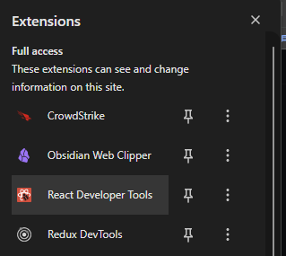
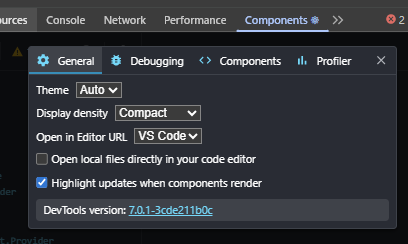
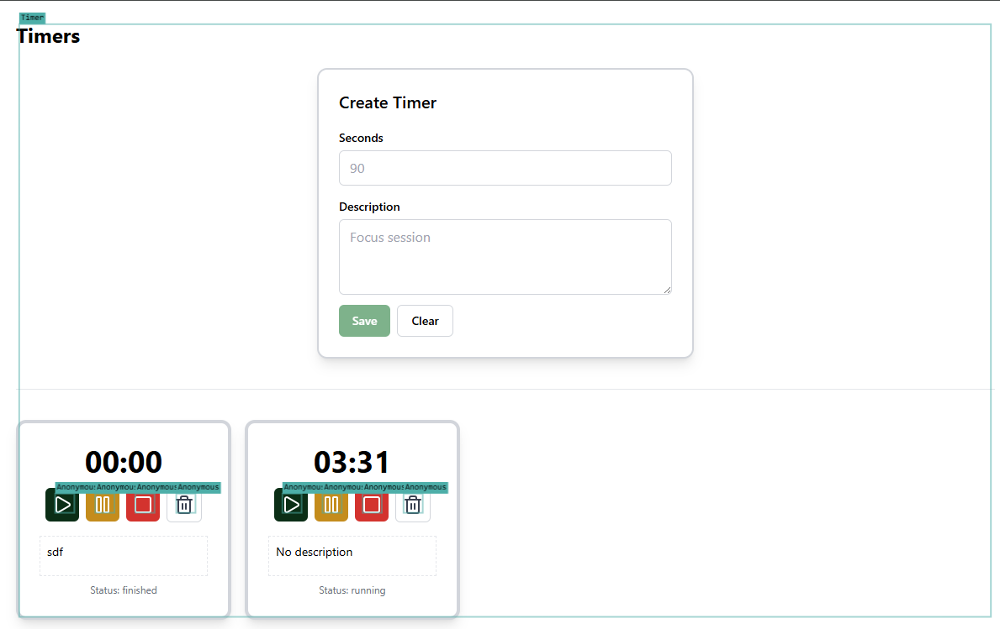
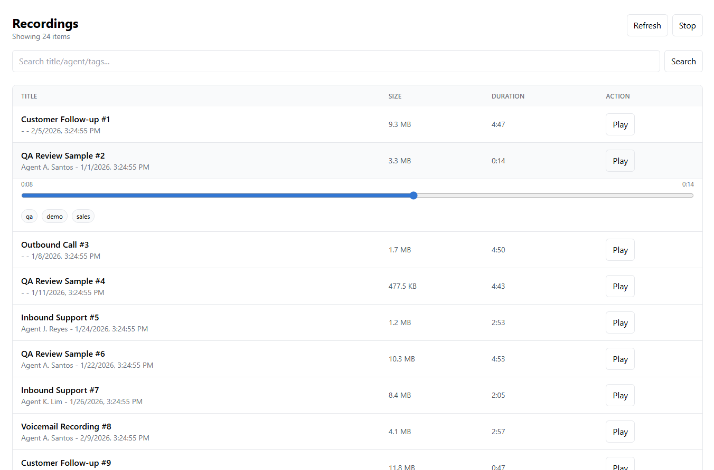
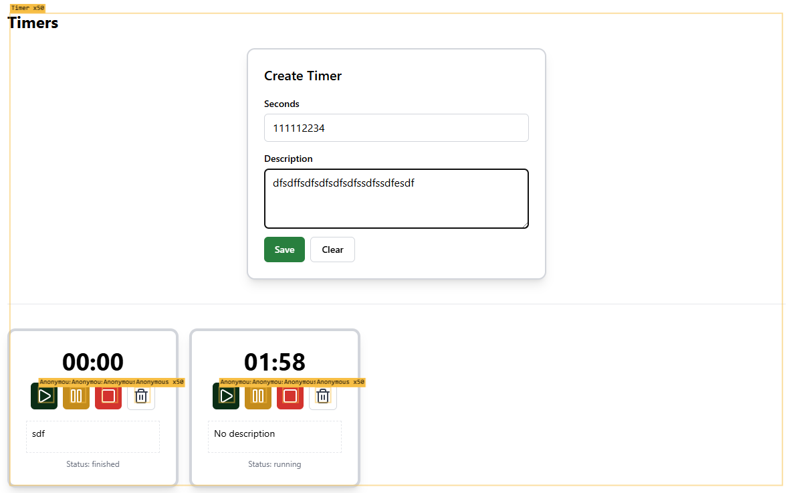
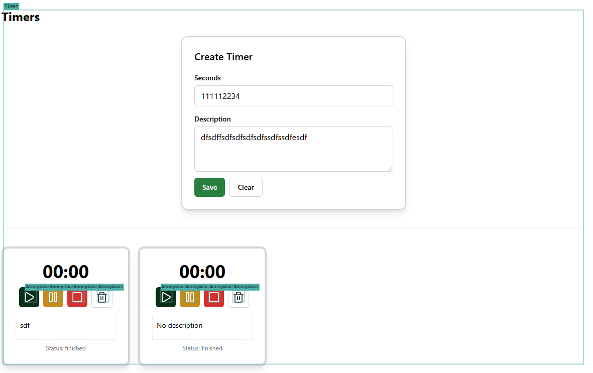
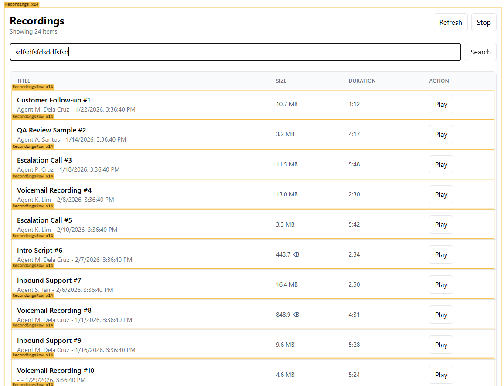
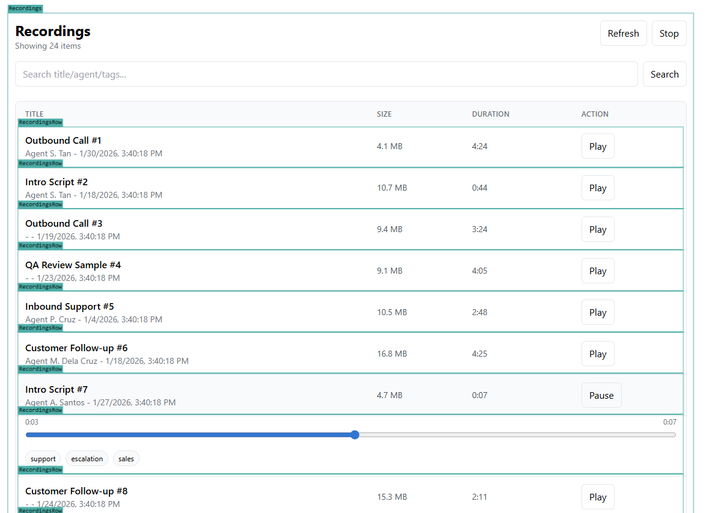

# Preparation

First install React Developer Tools for you browser and on settings pls check "Highlight updates when components render"

# Current state of the program

### Overview

* this was created with react and tailwind
* right now the application has timer page and recordings page
  
  
* to much re render issue.

### Timer page

* the whole timer page re-renders when at least one timer start to tick down.
* the whole components re-render when you inputs something on the input and text area.
  
* when the timers were 0 it stills re-renders 

### Recordings page

* there is a table that lists the recordings and where you can play the audio.
* when you search something the current program generates random call recording.
* the whole page re-renders also when you input characters on the input
  
* also the page re-renders when you play voice recordings
  

# What needs to be updated

### Non page-specific goals

* [ ] add a sidebar for the navigation between to pages.

### Timer page goals

* [ ] fix the re-render on the timer page.
* [ ] make the timers not synced to a single tick.
* [ ] move the create timer card to a modal/dialog box

### Recordings page goals

* [ ] fix the re-renders
* [ ] implement Redux
* [ ] add pagination
* [ ] when you search recordings, it generates random recordings which should not. At the first load of the page you must generate atleast 100 recording records. and use this records for your pagination and search to work

